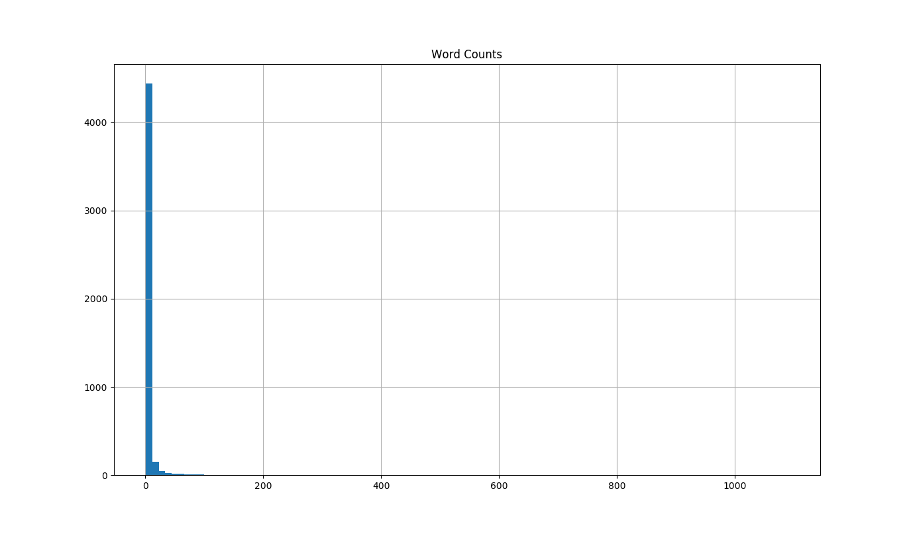

# hamlet-text-mining

This is a simple text mining and analysis of Shakespeare's **Hamlet** using `python3`. In here, an [English online open version](http://erdani.com/tdpl/hamlet.txt) of the whole play was considered. Since the version is available in `txt` format, the `requests` module was used to connect to the url address and download the text content.
 

## Text Preprocessing

A two-step preprocessing procedure was applied to the full text. Initially all punctuation characters were removed to make easy the task of analyzing words. Punctuation characters consist of the following characters:
> !"#$%&\'()*+,-./:;<=>?@[\\]^_`{|}~

Finally, abbreviation names were converted back to real names. The goal is to identify abbreviations like **_Ham._** or **_Oph._** and convert back to the respective names **_Hamlet_** and **_Ophelia_** for instance. This is an important step, since abbreviations can be appears several times announcing each character lines (specially true for Hamlet!), and therefore, the total counts for the respective name can be miscounted.

Once preprocessing is complete, a total number of **31953 words** was found.

## Word Counts
All words were converted to upper case mode to prevent counting the same word separetely (some words may appear at the beginning of a sentence). The following table list describes in descending order the top 10 most frequent used words.

Word   | Counts
:------: | :---------:
THE        | 1090
AND        |  964
TO         |  742
OF         |  675
I          |  577
A          |  558
YOU        |  554
MY         |  520
HAMLET     |  465
IN         |  434

As expected, many of these words are very common in English (the only exception is *HAMLET*). These are called **stopwords** and barely bring new information.

The distribution of word counts (frequency) were analyzed as well. The following figure shows the histogram of all possible counts for different words.

The distribution of word counts is highly assimetric as very few different words appeared more than 400 times. In the other hand, the vast majority is seldom used (90% of all words appeared no more than 9 times!).

